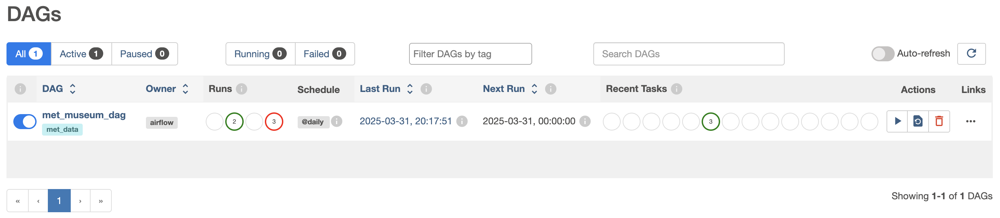

# de-zoomcamp-2025-project

## About the project

The project target is to get some insights on artworks available in NYC Metropolitan Museum. All the data used in this project is publicly available through the museum's REST API: [https://metmuseum.github.io/](https://metmuseum.github.io/)

Following dashboard was created using the API data: [Dashboard](https://lookerstudio.google.com/reporting/0e7d5875-999e-4fa6-9c6d-35adfdb9bd2b).

__Chart 1__


__Chart 2__


__Bonus chart__


### Components

- Infrastructure as Code: [Terraform](https://www.terraform.io/)
- Containerization: [Docker with docker compose](https://www.docker.com/)
- Workflow Orchestration: [Airflow](https://airflow.apache.org/)
- Extract and Load data: [dltHub](https://dlthub.com/)
- Data transformarions: [dbt Core](https://docs.getdbt.com/docs/core/installation-overview)
- Data Lake: [Google Cloud Storage](https://cloud.google.com/storage)
- Data Warehouse: [Google BigQuery](https://cloud.google.com/bigquery)
- Data visualisation: [Looker Studio](https://lookerstudio.google.com/)

Terraform software is used to provision GCP infrastructure (GCS bucket and BigQuery dataset).

Workflow orchestration is done in Apache Airflow which runs in a local docker container (with dlt and dbt packages installed). The whole ELT process for museum data was setup in a single DAG `met_museum_dag` which is set to be running on a daily schedule. 

The DAG runs the following tasks:
- `extract_load_data` - dlt pipeline extracts data from API endpoints and loads it to GCS bucket as Parquet files.
- `create_external_table` - creates an external table in BigQuery based on files in GCS bucket. For this purpose dbt package is used: 
[dbt_external_tables](https://hub.getdbt.com/dbt-labs/dbt_external_tables/latest/)
- `transform_data` - dbt run command creates new tables in BigQuery and transforms the data having external table as a source.

Data in a staging table is partitioned by `metadata_date`  (patition by DAY) and clustered by `department` and `classification` columns to speed up transformation queries.

Data visualisation is done in Looker Studio which uses the created BigQuery tables as data sources for charts.

__Dbt lineage graph__


## Project setup

__NOTE: The project was developed and tested on MacOS system.__

### Prerequisites
- [Install terraform](https://developer.hashicorp.com/terraform/tutorials/aws-get-started/install-cli#install-terraform)
- [Install docker](https://docs.docker.com/engine/install/)
- Clone the repository
- Optionally: install `jq` bash command: https://jqlang.org/download/

### GCP setup
Steps to generate GCP credentials file:
1. Create a new [Google Cloud project](https://cloud.google.com/resource-manager/docs/creating-managing-projects#creating_a_project) (if you don't have one)
2. Create a new [service account](https://cloud.google.com/iam/docs/service-accounts-create#creating) with the following roles:
    - BigQuery Admin
    - Storage Admin
3. Create and download [JSON service account key](https://cloud.google.com/iam/docs/keys-create-delete#creating):
    - Store a downloaded JSON key file in the location of your choice
    - Set an environment variable with an absolute path to your JSON key file:

    ```sh
    export GOOGLE_APPLICATION_CREDENTIALS=<path-to-JSON-file>
    ```

### Local setup

The following 2 steps are required in this project for the terraform commands to be properly running and for the Airflow image to be properly built. Each step can be done manually or by running a bash script provided in repo:

1. Copy GCP JSON key file to the repo `gcp_credentials` folder:
    - Option 1 - run the provided bash script:

    ```sh
    source scripts/pre-build.sh
    ```

    - Option 2:
        - create a folder `gcp_credentials` inside a cloned repo
        - copy your JSON key file to the created folder
        - rename the copied JSON key file to `service_account.json`

2. Set required environment variables:
    - Option 1 - run the provided bash script (Note: this script requires `jq` bash command):

    ```sh
    source scripts/set_variables.sh 
    ```

    - Option 2 - set the following variables manually:

    ```sh
    export GCP_PROJECT_ID=<project_id from your JSON key file>
    export GCP_CLIENT_EMAIL=<client_email from your JSON key>
    export GCP_PRIVATE_KEY=<private_key from your JSON key>
    export GCS_BUCKET_NAME="${GCP_PROJECT_ID}-bucket"
    export BQ_DATASET_NAME=met_museum_data

    # Variables for teraform
    export TF_VAR_gcp_project=$GCP_PROJECT_ID
    export TF_VAR_gcs_bucket_name=$GCS_BUCKET_NAME
    export TF_VAR_bq_dataset_name=$BQ_DATASET_NAME
    ```

### Create GCP infrastructure

Run the following terraform commands (see configs in [terraform folder](terraform/)):

- Initialize terraform state:

```sh
terraform -chdir=./terraform init
```

- Validate infra plan:

```sh
terraform -chdir=./terraform plan
```

- Create your infrastructure:

```sh
terraform -chdir=./terraform apply
```

### Airflow

Airflow image is based on the configuration in [docker-compose.yaml](docker-compose.yaml) and a custom [Dockerfile](Dockerfile). Both files were created following this guide: [Running Airflow in Docker](https://airflow.apache.org/docs/apache-airflow/stable/howto/docker-compose/index.html).

Run the following commands to run Airflow service locally:

- Build a custom Airflow image:
    ```sh
    docker compose build
    ```

- Initialize Airflow database:
    ```sh
    docker compose up airflow-init
    ```

- Start Airflow containers in a detached mode:
    ```sh
    docker compose up -d
    ```

Once all of the containers are running the web Airflow GUI will be available under localhost URL: [http://localhost:8080/](http://localhost:8080/).

The default username and password is: `airflow`.


#### Trigger the Airflow DAG

After successful login you should see a `met_museum_dag` listed on the main GUI page (as per image below).



To trigger the DAG click on the "play" icon on the right side of the page. Run details can be viewed by clicking on the DAG name.


In the DAG details click "Graph" tab to see the tasks lineage graphs. The run is considered successfully finished once all the squares indicating each of the DAG's tasks are flashing green. Logs for each task can be reviewed in "Logs" tab after clicking on a specific task.

__NOTE: The API used in this project requires a seperate API call for each extracted object. This results in the extract/load process being quite slow (20 minutes or more).__

__The dlt pipeline is set to be extracting only objects updated in last 2 weeks. This behaviour can be customized by changing `DAYS_OFFSET` variable (defaults to 14 days) in file: [dlt_pipeline/extract_to_gcs.py](dlt_pipeline/extract_to_gcs.py)__